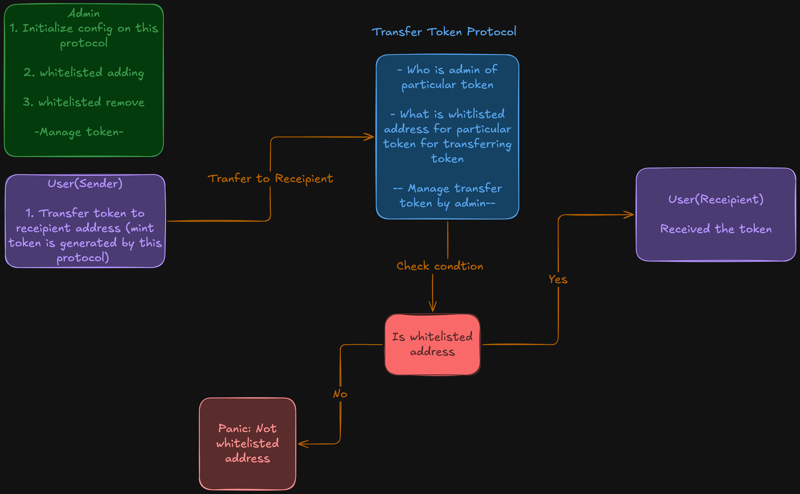

# Whitelist Transfer Hook

A **Solana program** that uses the **SPL Token 2022 Transfer Hook** interface to enforce whitelist-based access control on token transfers. Only addresses that an admin has whitelisted can transfer tokens from their accounts—everyone else is blocked at the program level.

---

## Table of Contents

- [What is this?](#what-is-this)
- [Concepts for beginners](#concepts-for-beginners)
- [Protocol overview](#protocol-overview)
- [Devnet deployment](#devnet-deployment)
- [Architecture](#architecture)
- [Program flow](#program-flow)
- [State accounts](#state-accounts)
- [Instructions](#instructions)
- [Quick start](#quick-start)
- [Testing](#testing)
- [Resources](#resources)

---

## What is this?

This project is an **on-chain whitelist** for **Token 2022** mints. When a mint is created with this program as its transfer hook:

- **Whitelisted users** → Can send the token as normal.
- **Non-whitelisted users** → Any transfer **from** their token account is rejected by the program.

Admins use the program to add or remove addresses from the whitelist. The check happens automatically on every transfer, with no extra steps for compliant users.

---

## Concepts for beginners

| Term                              | Meaning                                                                                              |
| --------------------------------- | ---------------------------------------------------------------------------------------------------- |
| **SPL Token / Token Program**     | Solana’s standard for fungible tokens (balances, mints, transfers).                                  |
| **Token 2022**                    | An upgraded token program with extensions (e.g. transfer hooks, interest, confidential transfers).   |
| **Transfer hook**                 | Code that runs **during** a token transfer. It can allow or deny the transfer based on custom logic. |
| **Whitelist**                     | A list of addresses that are allowed to do something (here: transfer the token).                     |
| **PDA (Program Derived Address)** | An address derived from seeds and program ID. no private key, only the program can “sign” for it.    |

**In one sentence:** This program is the “transfer hook” that Token 2022 calls on every transfer. the hook allows the transfer only if the **source token account owner** is on the whitelist.

---

## Protocol overview

The diagram below summarizes how the whitelist transfer hook fits into the Token 2022 transfer flow.



_High level: Admin configures a mint and whitelist. Token 2022 runs our hook on each transfer. the hook allows or denies based on the whitelist._

---

## Devnet deployment

The program is deployed on **Solana Devnet** so you can interact with it without running a local validator.

| Item              | Value                                                                                      |
| ----------------- | ------------------------------------------------------------------------------------------ |
| **Network**       | Devnet                                                                                     |
| **Program ID**    | `EfvcbUrqid3P54BhoFLrJhAdJxe2vxKhGG9sDRvCsWHh`                                             |
| **IDL account**   | `8ySPjSvr6ntXcpU6SbyYgSxaWyYh7YU2TpHBnPErsPkR`                                             |
| **Deployment tx** | `3eBgGDkKsLY8s5qC2pnaaNUdms4BNKYcSCG2achwzXA1AUeiHiCprEm42QB2u7M9qJi3ZkEzw8ERZkbPvMWHbF62` |

**Example: connect with Anchor**

```ts
const programId = new PublicKey("EfvcbUrqid3P54BhoFLrJhAdJxe2vxKhGG9sDRvCsWHh");
const idl = await Program.fetchIdl(programId, provider);
const program = new Program(idl, programId, provider);
```

You can also load the IDL from the IDL account or from the repo’s `target/idl/whitelist_transfer_hook.json` and pass the same `programId` for devnet.

---

## Architecture

The program uses **four account roles**:

1. **Config** – One per admin. Stores who the admin is and a bump. Used to gate admin-only actions and to derive the program’s mint.
2. **WhitelistedUser** – One per whitelisted address. PDA per user; if this account exists, that user is allowed to transfer.
3. **Mint (Token 2022)** – The token mint with the Transfer Hook extension, pointing to this program.
4. **ExtraAccountMetaList** – Per-mint account that tells Token 2022 which extra accounts to pass into the hook (here: the `WhitelistedUser` PDA for the source owner).

All of these are PDAs derived from the program ID and documented seeds.

---

## Program flow

1. **Admin setup**

   - `init_config` – Create the admin’s Config PDA.
   - `add_to_whitelist(user)` – Create a WhitelistedUser PDA for `user`.
   - `remove_from_whitelist(user)` – Close the WhitelistedUser PDA for `user`.

2. **Mint and hook setup**

   - `init_mint(decimals)` – Create a Token 2022 mint with the Transfer Hook extension (authority: this program).
   - `initialize_transfer_hook` – Create and fill the ExtraAccountMetaList for that mint so Token 2022 knows to pass the `WhitelistedUser` PDA (derived from the source owner) into the hook.

3. **Transfers**
   - User sends a normal Token 2022 transfer (e.g. `createTransferCheckedInstruction`).
   - Token 2022 invokes this program’s transfer hook with the extra accounts (including the WhitelistedUser PDA for the source owner).
   - The hook checks that a WhitelistedUser account exists for the source owner and that it is in a “transferring” state. If not, the transfer fails.

So: **only whitelisted users (those with a WhitelistedUser account) can transfer.**

---

## State accounts

### Config

One per admin; seeds: `["config", admin_pubkey]`.

```rust
pub struct Config {
    pub admin: Pubkey,
    pub bump: u8,
}
```

Used to authenticate the admin and to derive the program’s mint PDA.

### WhitelistedUser

One per whitelisted address; seeds: `["whitelisted_user", user_pubkey]`.

```rust
pub struct WhitelistedUser {
    pub user: Pubkey,
    pub bump: u8,
}
```

If this PDA exists for a given user, that user is allowed to transfer. Removing from the whitelist closes this account.

---

## Instructions

| Instruction                   | Who                | Description                                                                                      |
| ----------------------------- | ------------------ | ------------------------------------------------------------------------------------------------ |
| `init_config`                 | Admin              | Create Config PDA for the admin.                                                                 |
| `add_to_whitelist(user)`      | Admin              | Create WhitelistedUser PDA for `user`.                                                           |
| `remove_from_whitelist(user)` | Admin              | Close WhitelistedUser PDA for `user`.                                                            |
| `init_mint(decimals)`         | Admin (via Config) | Create Token 2022 mint with Transfer Hook extension.                                             |
| `initialize_transfer_hook`    | Payer              | Create ExtraAccountMetaList for a mint so transfers include the whitelist PDA.                   |
| `transfer_token(amount)`      | —                  | **Called by Token 2022**, not directly by users. Validates that the source owner is whitelisted. |

User-facing transfers use the normal SPL Token 2022 transfer instruction; the program’s `transfer_token` runs as the hook invoked by Token 2022.

---

## Quick start

**Prerequisites:** Node.js, Yarn, Rust, Solana CLI, Anchor CLI.

1. Clone and install:

   ```bash
   cd whitelist-transfer-hook
   yarn install
   ```

2. Build:

   ```bash
   anchor build
   ```

3. Run tests (local validator):

   ```bash
   anchor test
   ```

4. To use **devnet** instead of a local validator, set your CLI to devnet and use the [Devnet deployment](#devnet-deployment) Program ID and IDL when building your client.

---

## Testing

Tests in `tests/whitelist-transfer-hook.ts` cover:

- Initializing admin config
- Adding and removing users from the whitelist
- Creating a Token 2022 mint with the transfer hook
- Creating token accounts and minting
- Creating the ExtraAccountMetaList for the mint
- Performing a transfer (with the extra accounts) so the hook is invoked

Run them with:

```bash
anchor test
```

---

## Resources

- [SPL Token 2022](https://spl.solana.com/token-2022)
- [Transfer Hook interface](https://spl.solana.com/token-2022/extensions#transfer-hook-extension)
- [Anchor](https://www.anchor-lang.com/)
- [Solana Cookbook](https://solanacookbook.com/)
- [Reference implementation](https://github.com/ASCorreia/whitelist-transfer-hook)

---

_This whitelist transfer hook provides a clear, on-chain access control layer for Token 2022 mints: only pre-approved addresses can transfer, while still using the standard token interface that wallets and applications expect._
